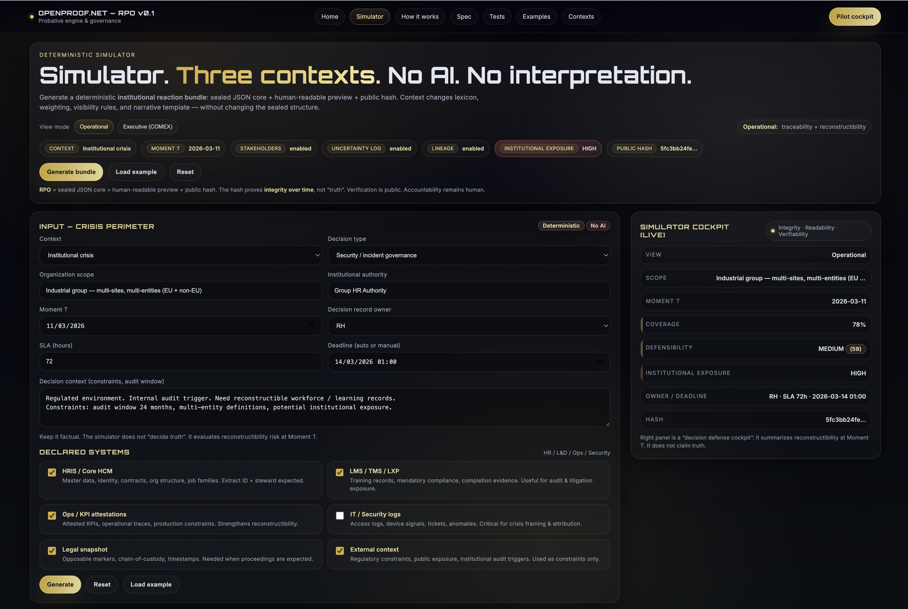

# 🔵 OpenProof — RPO Specification v0.1

Integrity · Readability · Verifiability

___

## Interactive demonstration

This repository also includes a deterministic simulator illustrating
how a Registered Probative Object (RPO) structures institutional
reaction bundles.

It demonstrates:

• sealed JSON core
• human-readable preview
• public integrity hash
• institutional exposure & defensibility indicators

The simulator does not implement a decision system.
It illustrates the OpenProof specification in practice.

👉 **Try the interactive simulator**

https://rpo.openproof.net/simulator.html

## Simulator preview



___

*A civil code for digital evidence in an age ruled by narratives.*

OpenProof defines a public, deterministic and testable format for structuring digital evidence.
Its core artifact, the RPO (Rapport Probatoire Ouvert), is a dual-format bundle allowing:

- machines to verify integrity,
- humans to read coherence,
- institutions to trust the structure of evidence.

OpenProof does not adjudicate truth.
It ensures that nothing can be altered without detection.

```text
Narrative → JSON → SHA-256 → Registry → Validation
```
___

## ▶️ Quick start — validate your first RPO bundle (10 seconds) 

Try it in 10 seconds
```bash
git clone https://rpo.openproof.net/ 
cd rpo-spec-v0.1
python tools/validate_rpo.py examples/rpo-example-001.json
```
___

## 👤 Who is this for?

- Developers → see “Minimal JSON Structure” + “Hashing Algorithm”
- Researchers → see “Scientific Pilot (CNRS × TruthX)”
- Legal teams → see “Validity & Immutability Guarantees”
- Institutions → see “Verifiability & immutability guarantees”
- Everyone → try the Sandbox in 10 seconds

___

## 💙 Why OpenProof Exists — The Crisis We Are Fixing

Digital evidence is collapsing.

Today, “evidence” often means:

- screenshots no system can authenticate,
- PDFs whose origin no one can verify,
- AI-generated narratives with no traceability,
- fragmented logs scattered across institutions,
- internal formats that die with each organisation.
- Everyone talks about truth. Very few artifacts are verifiable.

OpenProof is born from this failure.
It provides a minimal, deterministic and testable foundation that any machine, institution or jurisdiction can check — independently, predictably, transparently.

If machines can verify integrity, and humans can read coherence, society can trust evidence again.

___

## 🧠 Why This Matters for Organizations (HR, Governance, CEOs)

By 2027, organizations will not be challenged for making decisions —
but for being unable to explain, reconstruct, and defend them over time.

This applies directly to:
- people decisions,
- role assignments,
- promotions,
- exits,
- restructurings,
- compliance and risk arbitrations.

The problem is not intent.
The problem is traceability.

Without a structured, auditable and integrity-safe data foundation,
organizations are exposed — legally, socially, and reputationally.

OpenProof does not replace HR systems.
It provides a **proof layer** on top of them.

___

## Table of Contents

1. [🏛 What OpenProof Is — A Minimal, Enforceable Standard](#1--what-openproof-is--a-minimal-enforceable-standard)
2. [📦 Minimal RPO JSON Structure (v0.1)](#2--minimal-rpo-json-structure-v01)
3. [🔐 Hashing Algorithm (public_hash)](#3--hashing-algorithm-public_hash)
4. [✅ Validating an RPO Bundle](#4--validating-an-rpo-bundle)
5. [🧩 Generating a New RPO Bundle](#5--generating-a-new-rpo-bundle)
6. [🎯 Try the Engine — RPO Sandbox](#6--try-the-engine--rpo-sandbox)
7. [🔬 Scientific Pilot (CNRS × TruthX)](#7--scientific-pilot-cnrs--truthx)
8. [🤝 Contributing](#8--contributing)
9. [📫 Contact](#9--contact)
10. [🛡 Maintainer](#10--maintainer)


___

## 1. 🏛 What OpenProof Is — A Minimal, Enforceable Standard

The RPO guarantees three invariants:

#### ✔ Integrity

A signed JSON whose fields can be recomputed and validated.

#### ✔ Readability

A human-readable PDF mirroring the narrative.

#### ✔ Verifiability

A deterministic SHA-256 public hash anchoring immutability.

OpenProof does not determine what is “true”.
It ensures that any modification becomes detectable.

In organizational contexts, the RPO acts as a decision trace:
it captures **what data was available**, **what narrative was constructed**,
and **what decision followed** — in a form that can be audited later.

This is especially critical for HR, People Operations, and Governance teams,
where decisions are sensitive, distributed, and often contested years later.

___

## 2. 📦 Minimal RPO JSON Structure (v0.1)

This is the canonical baseline of a compliant RPO bundle:

```json
{
  "rpo_version": "0.1",
  "bundle_id": "string",
  "created_at": "ISO-8601 timestamp",
  "issuer": { "label": "string" },
  "subject": { "label": "string" },
  "narrative": {
    "title": "string",
    "text": "string",
    "pdf_hash": "string"
  },
  "evidence": [],
  "registry": {
    "public_hash": "sha256 hex",
    "registry_hint": "string"
  },
  "meta": {
    "playground": false
  }
}
```

### 2.1 Optional — JSON Schema

"schema": "https://json-schema.org/draft/2020-12/schema",
"type": "object",
"properties": { … }

___

## 3. 🔐 Hashing Algorithm (public_hash)

RPO v0.1 uses SHA-256 over a deterministic concatenation of core fields.

Concatenation model :

```
rpo_version=<v>|
bundle_id=<id>|
created_at=<iso>|
issuer=<label>|
subject=<label>|
title=<title>|
narrative=<text>|
```


Example (Python)


import hashlib

```python
import hashlib

def compute_public_hash(bundle):
    payload = (
        f"rpo_version={bundle['rpo_version']}|"
        f"bundle_id={bundle['bundle_id']}|"
        f"created_at={bundle['created_at']}|"
        f"issuer={bundle['issuer']['label']}|"
        f"subject={bundle['subject']['label']}|"
        f"title={bundle['narrative']['title']}|"
        f"narrative={bundle['narrative']['text']}"
    )
    return hashlib.sha256(payload.encode("utf-8")).hexdigest()
```


This guarantees deterministic validation across implementations.

___

## 4. ✅ Validating an RPO Bundle

Minimal validation helper (Python)


def validate_public_hash(bundle):
    expected = compute_public_hash(bundle)
    return expected == bundle["registry"]["public_hash"]

Required validations

Any implementation SHOULD verify:

- presence of mandatory fields,
- valid ISO-8601 created_at,
- public_hash is a 64-character hex string,
- narrative structure matches schema,
- recompute hash and reject on mismatch.

Optional (recommended)

- validate pdf_hash,
- ensure bundle_id uniqueness,
- run full JSON Schema validation.

___

## 5. 🧩 Generating a New RPO Bundle

Minimal example (Python):

import uuid
from datetime import datetime

```python
def validate_public_hash(bundle):
    expected = compute_public_hash(bundle)
    return expected == bundle["registry"]["public_hash"]
```

    
```python
import uuid
from datetime import datetime

def new_rpo(title, text, issuer, subject):
    bundle = {
        "rpo_version": "0.1",
        "bundle_id": f"rpo-{uuid.uuid4()}",
        "created_at": datetime.utcnow().isoformat() + "Z",
        "issuer":  { "label": issuer },
        "subject": { "label": subject },
        "narrative": {
            "title": title,
            "text": text,
            "pdf_hash": "placeholder"
        },
        "evidence": [],
        "registry": {
            "public_hash": "",
            "registry_hint": "No registry anchor in v0.1"
        },
        "meta": {
            "playground": False
        }
    }

    bundle["registry"]["public_hash"] = compute_public_hash(bundle)
    return bundle
```

___

## 6. 🎯 Try the Engine — RPO Sandbox

Open, deterministic, no AI, no registry.

The Sandbox lets you transform any narrative into:

- a minimal RPO JSON,
- heuristic markers,
- a deterministic SHA-256 hash.

🔗 https://rpo.openproof.net/simulator.html

___

## 🔐 Data, Trust and Governance Boundaries

OpenProof is designed with a strict separation of concerns.

- It does not decide how data should be interpreted.
- It does not expose confidential content.
- It does not automate judgment.

Its role is to ensure that:
- data is collected intentionally,
- transformations are traceable,
- decisions can be explained without rewriting history.

This is a prerequisite for trust —
both from employees and from regulators.

___

## 7. 🔬 Scientific Pilot (CNRS × TruthX)

The open standard does not include interpretive or psycho-forensic analysis.

These modules live in the scientific pilot:

- narrative inversion,
- coercive control signals,
- interpretive coherence,
- structure-level markers.

🔗 https://www.truthx.co/truthx-pilote-form

___

## 8. 🤝 Contributing

OpenProof welcomes contributions from:

- engineers (validation, hashing, schema),
- legal teams (probatory constraints),
- researchers (structures, bias, narrative logic),
- OSINT & forensic analysts (field use cases).

Issues and pull requests are encouraged in this repository.

___

## 9. 📫 Contact

Email: openproof@truthx.co

LinkedIn: https://www.linkedin.com/in/gryard/

___

## 10. 🛡 Maintainer

This specification is maintained by Gersende Ryard de Parcey.
